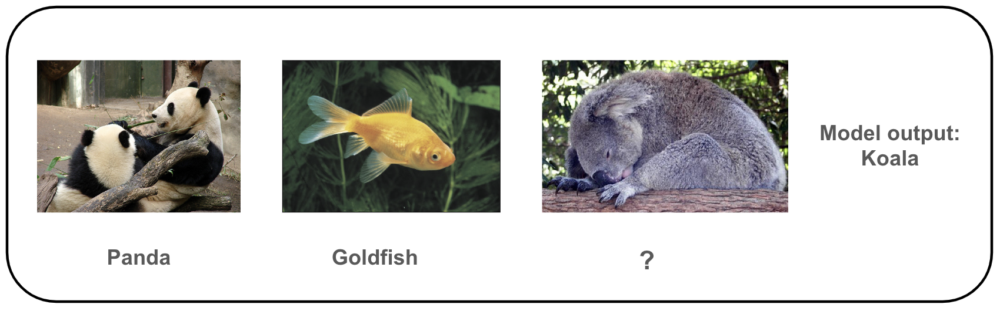
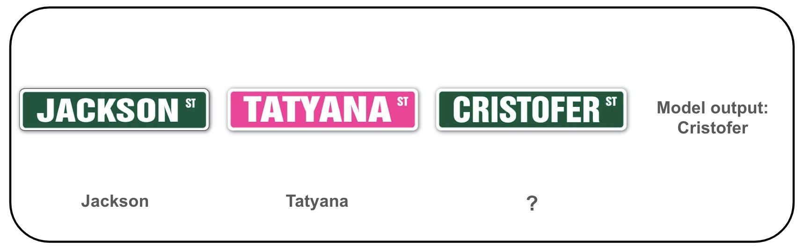

# Model description
We are excited to announce the continuation and rebranding of our **BLIP series** into **XGen-MM**, to be better aligned with Salesforce's unified XGen initiative for large foundation models! This rebranding marks a significant step in our ongoing development of cutting-edge multimodal technologies.

`XGen-MM` is a series of the latest foundational Large Multimodal Models (LMMs) developed by Salesforce AI Research. This series advances upon the successful designs of the `BLIP` series, incorporating fundamental enhancements that ensure a more robust and superior foundation. These models have been trained at scale on high-quality image caption datasets and interleaved image-text data. 

In the v1.5 (08/2024) release, we present a series of XGen-MM models including:
- [🤗 xGen-MM-base](https://huggingface.co/Salesforce/xgen-mm-phi3-mini-base-r-v1.5): `xgen-mm-phi3-mini-base-r-v1.5`
- [🤗 xGen-MM-instruct](https://huggingface.co/Salesforce/xgen-mm-phi3-mini-instruct-r-v1.5): `xgen-mm-phi3-mini-instruct-r-v1.5`
- [🤗 xGen-MM-instruct-interleave](https://huggingface.co/Salesforce/xgen-mm-phi3-mini-instruct-multi-r-v1.5): `xgen-mm-phi3-mini-instruct-multi-r-v1.5`
- [🤗 xGen-MM-instruct-dpo](https://huggingface.co/Salesforce/xgen-mm-phi3-mini-instruct-dpo-r-v1.5): `xgen-mm-phi3-mini-instruct-dpo-r-v1.5`

In addition to the models, we are also releasing a series of datasets for multi-modal pre-training, including:
- [🍃 MINT-1T: Scaling Open-Source Multimodal Data by 10x: A Multimodal Dataset with One Trillion Tokens](https://arxiv.org/abs/2406.11271)
- [🤗 BLIP3-OCR-200M](https://huggingface.co/datasets/Salesforce/blip3-ocr-200m): a dataset with dense OCR annotations.
- [🤗 BLIP3-GROUNDING-50M](https://huggingface.co/datasets/Salesforce/blip3-grounding-50m): a dataset for enhancing the ability to ground semantic concepts in images.
- BLIP3-KALE-300M (stay tuned): a large-scale curated high-quality caption dataset. 

For more details, check out our [tech report]() and project page (coming soon).

# Data
The base model is pre-trained on a mixture of data sources described above, with around 100 billion image-text tokens in total.


# Results

### Few-shot Evaluation on Base model (without instruction tuning)

| Model         | Shot | VQAv2 | TextVQA | OKVQA | COCO  | NoCaps | TextCaps |
|:--------------|:-----|:------|:--------|:------|:------|:-------|:---------|
| Flamingo-3B   | 0    | 49.2  | 30.1    | 41.2  | 73.0  | -      | -        |
|               | 4    | 53.2  | 32.7    | 43.3  | 85.0  | -      | -        |
|               | 8    | 55.4  | 32.4    | 44.6  | 90.6  | -      | -        |
| MM1-3B        | 0    | 46.2  | 29.4    | 26.1  | 73.5  | 55.6   | 63.3     |
|               | 4    | 57.9  | 45.3    | 44.6  | **112.3** | 99.7   | 84.1     |
|               | 8    | 63.6  | 44.6    | 48.4  | **114.6** | **104.7**  | 88.8     |
| xGen-MM-base  | 0    | 43.1  | 34.0    | 28.0  | 67.2  | 82.6   | 69.5     |
|               | 4    | **66.3**| **54.2**| **48.9**| 107.6 | **100.8**| **89.9**     |
|               | 8    | **66.9**| **55.3**| **50.1**| 109.8| 104.6| **94.0**|


### Showcases on In-Context Learning

Below are some qualitative examples below of the mutli-modal in-context learning capacity of our base model.








# How to use

Please check out our [inference notebook](demo.ipynb) for example code to use our model. We also provide example script for [batch inference](batch_inference.ipynb).

# Reproducibility: 

The pretraining evaluation is implemented based on [OpenFlamingo: An open-source framework for training large multimodal models.](https://github.com/mlfoundations/open_flamingo).
Few-shot examples are randomly drawn so there will be some variance with different random seeds.

# Bias, Risks, Limitations, and Ethical Considerations
The main data sources are from the internet, including webpages, 
image stock sites, and curated datasets released by the research community. We have excluded certain data, such as LAION, due to known CSAM concerns.
The model may be subject to bias from the original data source, as well as bias from LLMs and commercial APIs. 
We strongly recommend users assess safety and fairness before applying to downstream applications. 


# License

Our code and weights are released under the Creative Commons Attribution Non Commercial 4.0 [LICENSE](LICENSE.txt). Please fill out a form at [here](https://forms.gle/ffPc9oZC2ZGeJ1N68) to consult the commercial use of model weights.

# Code acknowledgement
Our training code is based on [OpenFlamingo: An open-source framework for training large multimodal models.](https://github.com/mlfoundations/open_flamingo), and part of our data preprocessing code is adapted from [LLaVA](https://github.com/haotian-liu/LLaVA).
Our evaluation code is based on [VLMEvalKit: Open-source evaluation toolkit of large vision-language models (LVLMs)](https://github.com/open-compass/VLMEvalKit).

We thank the authors for their open-source implementations.


# Citation
```
@misc{xgen_mm_phi3_mini,
    title={xgen-mm-phi3-mini-base Model Card},
    url={https://huggingface.co/Salesforce/xgen-mm-phi3-mini-instruct-r-v1},
    author={Salesforce AI Research},
    month={May},
    year={2024}
}
```

# Troubleshoot

1. If you missed any packages, please consider the following

```
pip install torch==2.2.1 torchvision==0.17.1 torchaudio==2.2.1 --index-url https://download.pytorch.org/whl/cu121
pip install open_clip_torch==2.24.0
pip install einops
pip install einops-exts
pip install transformers==4.41.1
```